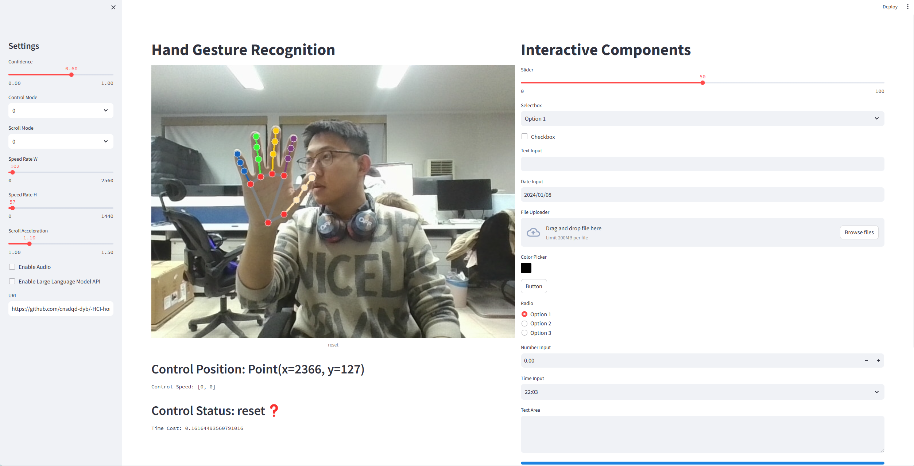
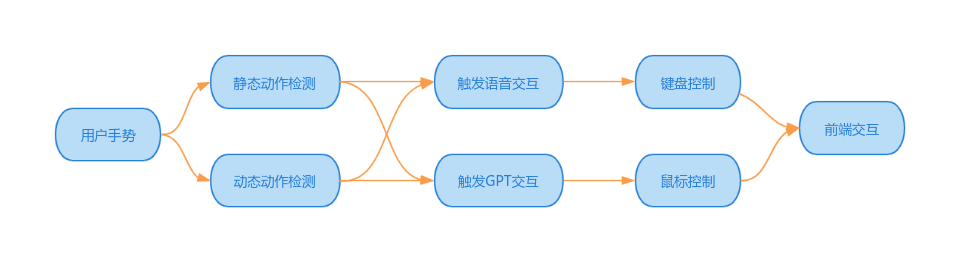

 # Post-WIMP Hand and Voice Interaction System

## Overview

This project aims to implement a Post-WIMP (Window, Icon, Menu, Pointing Device) interaction system that leverages hand gestures and voice commands to control a computer. The system is designed to enhance user experience by providing a more natural and intuitive way of interacting with digital interfaces.

## Features

- **Real-time Gesture Recognition**: Utilizes `mediapipe` to capture and interpret hand gestures.
- **Dynamic Gesture Classification**: Employs a trained Random Forest (RF) model to classify user gestures into actions.
- **Voice Recognition**: Integrates OpenAI's API for voice-to-text conversion and intelligent responses.
- **Multimodal Interaction**: Combines both hand gestures and voice commands for a richer interaction experience.
- **Intuitive UI Feedback**: Provides visual feedback on the system's status and actions taken.
- **Error Handling and Recovery**: Implements mechanisms to handle errors and allow user retries.

## Technical Details

### Gesture Recognition

The system uses `mediapipe` to detect hand landmarks in real-time. These landmarks are then processed by a trained RF model to recognize dynamic gesture trajectories.

### Voice Interaction

Voice commands are captured and converted into text using OpenAI's API. The system can then execute actions based on the recognized voice input.

### User Interface

The front-end provides two interfaces: one using `OpenCV` for real-time feedback and stability, and another using `Streamlit` for a more interactive and user-friendly experience.

### System Stability and Error Handling

The system includes error detection and recovery mechanisms to ensure smooth user interaction.

## Getting Started

To run the system, follow these steps:

1. **Install Dependencies**: Ensure you have `mediapipe`, `OpenAI` API, `pyautogui`, and `streamlit` installed.
2. **Set Up the Environment**: Configure the system settings as per your preferences (e.g., confidence levels, scroll modes, etc.).
3. **Run the Application**: Execute the Python script to start the application. (streamlit run app.py)

## Usage

- **Gesture Controls**: Perform specific hand gestures to control the computer (e.g., move the mouse, click, drag, etc.).
- **Voice Commands**: Speak commands to perform actions or receive suggestions from the AI assistant.

## Illustrations

[Insert image of hand gesture recognition here]

[Insert image of voice recognition process here]

[Insert image of Streamlit interface here]

## Contributing

We welcome contributions to improve the system. Please follow the standard GitHub contribution guidelines.

## License

This project is licensed under the [MIT License](LICENSE).

## Contact

For any questions or suggestions, please contact [your-email@example.com](mailto:your-email@example.com).